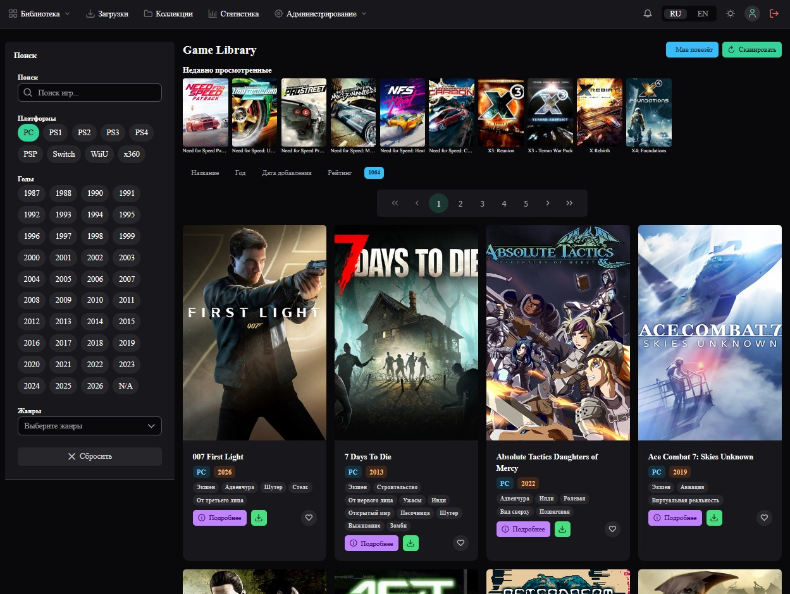

# GameLibrary

<p align="center">
  
  
  
  
  
</p>

<p align="center">
  <b>EN:</b> Game catalog manager for NAS — scan filesystem, fetch metadata from 7 scrapers, browse & download via P2P torrents.
  <br>
  <b>RU:</b> Каталогизатор компьютерных игр для NAS — сканирование ФС, сбор метаданных из 7 скраперов, просмотр и скачивание через P2P-торренты.
</p>

<p align="center">
  
</p>

---

<p align="center">
  <a href="#-features">Features</a> &nbsp;•&nbsp;
  <a href="#-quick-start">Quick Start</a> &nbsp;•&nbsp;
  <a href="INSTRUCTION.md">📖 Full Instructions</a> &nbsp;•&nbsp;
  <a href="#-tech-stack">Tech Stack</a> &nbsp;•&nbsp;
  <a href="#-architecture">Architecture</a> &nbsp;•&nbsp;
  <a href="#-configuration">Configuration</a> &nbsp;•&nbsp;
  <a href="#-scrapers">Scrapers</a> &nbsp;•&nbsp;
  <a href="#-deployment">Deployment</a> &nbsp;•&nbsp;
  <a href="#-troubleshooting">Troubleshooting</a>
</p>

<p align="center">
  <a href="#en">🇬🇧 English</a> &nbsp;|&nbsp; <a href="#ru">🇷🇺 Русский</a>
</p>

---

<a name="en"></a>

# English

## ✨ Features

| For users | For admins |
|-----------|-----------|
| Game grid with posters & filters | Filesystem scanning & auto-indexing |
| Search by name, platform, genre, year | Metadata scraping (7 scrapers) |
| Sorting & pagination | Game editor with Quill rich text |
| ZIP download (<5 GB) / .torrent download (≥5 GB) | User management (roles, block, reset password) |
| P2P seeding via Transmission | Scraper config panel (API keys, enable/disable) |
| Profile, avatar, password change | |
| Russian / English UI | |
| ⭐ Rating 1-10 per game | |
| ❤️ Favorites collection with filter | |
| 💬 Comments on game pages | |
| 🔔 Notifications (torrent ready, scan done, etc.) | |
| 👁 View history (last 20, stored in localStorage) | |
| 🔗 Related games (same genre or similar name) | |

## ⚡ Quick Start

```bash
cp .env.example .env          # set secrets first
make all                      # builds backend + frontend, starts docker-compose
```

Opens at `http://localhost` — login as `admin` / `password`.

> 📖 **Step-by-step deployment guide for beginners** → [INSTRUCTION.md](INSTRUCTION.md) (setup, scrapers, troubleshooting)

## 📦 Tech Stack

| Component | Technology |
|-----------|-----------|
| Backend | Spring Boot 4.0.7, Java 25 |
| Frontend | Vue 3 + Vite 5, PrimeVue 4, Pinia, VueQuill (Quill 2) |
| Database | PostgreSQL 16 (schema `library`) |
| ORM / JDBC | Hibernate (managed by Boot 4.x), Spring Data JPA, HikariCP |
| REST API | Spring MVC `@RestController`, JWT auth (form login fallback) |
| API Docs | OpenAPI / Swagger UI at `/game-library/swagger-ui.html` |
| Downloads | ZIP streaming (STORED, no compression) + BitTorrent via Transmission (JSON-RPC) |
| P2P Tracker | Built-in HTTP tracker at `/api/tracker/announce` |
| Scraping | OkHttp 4, Jsoup, Steam Storefront API, Twitch OAuth (IGDB) |
| Build | Maven (JAR) + npm / Vite |
| Containerization | Docker, docker-compose (4 services) |

## 🏗 Architecture

```
┌─────────┐   :80   ┌──────────┐   :8080  ┌──────────────────┐
│ Browser │ ──────▶ │  Nginx   │ ──────▶  │   Backend        │
└─────────┘         │ (Vue SPA)│          │  (REST API)      │
                    └──────────┘          │  + Tracker       │
                                          └───┬────────┬─────┘
                                              │        ▲
                                              │        │ announce
                                              │  ┌─────┴──────────┐
                                              │  │  Transmission  │ :9091 RPC
                                              │  │  (seeder)      │ :51413 P2P
                                              │  └──────┬─────────┘
                                              │         │
                     ┌──────────────┐         │
                     │  PostgreSQL  │  :5432  │
                     └──────────────┘         │
                     User torrent clients
                     (qBittorrent, Transmission, etc.)
                         │              ▲
                         └───── P2P ────┘
```

### Frontend Routes

| URL | Access | Description |
|-----|--------|-------------|
| `/login` | all | Login form |
| `/register` | all | Registration |
| `/` | USER, ADMIN | Library grid — filters, sorting, pagination |
| `/game/:id` | USER, ADMIN | Game detail page |
| `/game/:id/edit` | ADMIN | Editor + scraping panel |
| `/profile` | USER | Profile, avatar, password change |
| `/admin/users` | ADMIN | User management |
| `/admin/scrapers` | ADMIN | Scraper config (API keys, on/off) |
| `/downloads` | USER, ADMIN | Transmission seeding status |

### API Endpoints

All under `/game-library/api/`. Auth: JWT Bearer token.

| Endpoint | Access | Description |
|----------|--------|-------------|
| **Auth** | | |
| `POST /auth/login` | all | Login → JWT + profile |
| `POST /auth/register` | all | Register new user |
| `GET /auth/me` | USER, ADMIN | Current user info |
| **Games** | | |
| `GET /games` | USER, ADMIN | Game list (filters, sort, page, `favoritesOnly`) |
| `GET /games/filter-options` | USER, ADMIN | Years, platforms, genres for filter UI |
| `GET /games/scrapers` | USER, ADMIN | List enabled scraper sources |
| `GET /games/{id}` | USER, ADMIN | Game details |
| `POST /games/{id}/edit` | ADMIN | Save game edits |
| `POST /games/{id}/grab` | ADMIN | Scrape metadata from selected scraper |
| `GET /games/{id}/download` | USER, ADMIN | Stream ZIP (<5 GB) or .torrent (≥5 GB) |
| `GET /games/{id}/download-info` | USER, ADMIN | Download info (size, torrent cached flag) |
| `POST /games/{id}/seed` | USER, ADMIN | Start seeding via Transmission |
| `POST /games/{id}/prepare-download` | USER, ADMIN | Async .torrent preparation (for ≥5 GB games) |
| `GET /games/{id}/rating` | USER, ADMIN | Get game rating |
| `POST /games/{id}/rate` | USER, ADMIN | Rate game 1-10 |
| `POST /games/{id}/favorite` | USER, ADMIN | Toggle favorite |
| `GET /games/{id}/favorite` | USER, ADMIN | Check if favorited |
| `GET /games/{id}/comments` | USER, ADMIN | Get game comments |
| `POST /games/{id}/comments` | USER, ADMIN | Add comment |
| `DELETE /games/{id}/comments/{commentId}` | USER, ADMIN | Delete own comment |
| `GET /games/{id}/related` | USER, ADMIN | Related games by genre/name (same platform removed) |
| **Downloads** | | |
| `GET /download/prepare-status/{taskId}` | USER, ADMIN | Torrent preparation task status |
| `GET /seed/status/{taskId}` | USER, ADMIN | Seed task status |
| `GET /downloads/active` | USER, ADMIN | Active Transmission torrents |
| `GET /downloads/waiting` | USER, ADMIN | Waiting Transmission torrents |
| `GET /downloads/stopped` | USER, ADMIN | Stopped Transmission torrents |
| `GET /downloads/{gid}/status` | USER, ADMIN | Single torrent status |
| `POST /downloads/{gid}/remove` | USER, ADMIN | Remove torrent (keep files) |
| `POST /downloads/{gid}/pause` | USER, ADMIN | Pause torrent |
| `POST /downloads/{gid}/unpause` | USER, ADMIN | Resume torrent |
| `GET /downloads/global-stat` | USER, ADMIN | Transmission session stats |
| `GET /downloads/aria2-version` | USER, ADMIN | Transmission connectivity check |
| **Notifications** | | |
| `GET /notifications` | USER, ADMIN | Get latest 20 notifications |
| `PUT /notifications/{id}/read` | USER, ADMIN | Mark notification as read |
| `PUT /notifications/read-all` | USER, ADMIN | Mark all notifications as read |
| `GET /notifications/unread-count` | USER, ADMIN | Unread notification count |
| **Images** | | |
| `GET /images/games/{gameId}/logo` | all | Game logo (FS → DB fallback) |
| `GET /images/games/{gameId}/screenshots/{screenshotId}` | all | Screenshot (FS → DB fallback) |
| `GET /images/avatars/{userId}` | all | User avatar (FS → DB fallback) |
| **Profile** | | |
| `GET /profile` | USER, ADMIN | Profile data |
| `PUT /profile` | USER, ADMIN | Update profile (avatar, name) |
| `POST /profile/pass` | USER, ADMIN | Change password |
| **Admin — Scan** | | |
| `POST /scan` | ADMIN | Start filesystem library scan |
| **Admin — Users** | | |
| `GET /admin/users` | ADMIN | List all users |
| `POST /admin/users/{id}/toggle-admin` | ADMIN | Toggle admin role |
| `POST /admin/users/{id}/toggle-active` | ADMIN | Block / unblock user |
| `POST /admin/users/{id}/reset-pass` | ADMIN | Reset password (auto-generated or `RESET_PASSWORD_DEFAULT` env) |
| **Admin — Scrapers** | | |
| `GET /admin/scraper-config` | ADMIN | List all scraper configs |
| `GET /admin/scraper-config/{type}` | ADMIN | Get single scraper config |
| `PUT /admin/scraper-config/{type}` | ADMIN | Update single scraper config |
| `POST /admin/scraper-config/reload` | ADMIN | Reload config from disk |
| **Tracker** | | |
| `GET /tracker/announce` | all | BitTorrent HTTP tracker announce |
| `GET /tracker/scrape` | all | BitTorrent HTTP tracker scrape |

## 🔧 Configuration

### Filesystem Layout

```
<games_directory>/games/
└── <platform>/                       (e.g. PC, PlayStation, Xbox)
    └── <game_name>/
        ├── <game files>...
        └── information/              (created during scan)
            ├── logo.jpg              (poster)
            ├── information.json      (name, year, genres, description, trailer, manual)
            └── img/                  (screenshots .jpg)
```

### Environment Variables

#### Required (no defaults — must be set in `.env`)

| Variable | Description |
|----------|-------------|
| `POSTGRES_PASSWORD` | PostgreSQL superuser password |
| `DB_PASSWORD` | PostgreSQL application user (`library-manager-user`) password |
| `JWT_SECRET` | JWT signing secret (generate: `openssl rand -hex 32`) |
| `SCRAPER_ENCRYPTION_KEY` | AES-256 base64 key for scraper API key encryption (generate: `openssl rand -base64 32`) |

#### Optional (with defaults)

| Variable | Default | Description |
|----------|---------|-------------|
| `SERVER_PORT` | `8080` | Backend port |
| `DB_HOST` | `localhost` | PostgreSQL host |
| `DB_PORT` | `5432` | PostgreSQL port |
| `GAMES_DIRECTORY` | `/gameLibrary` | Game files root |
| `IMAGES_DIRECTORY` | `/gameLibrary/images` | Images on filesystem |
| `TRACKER_ANNOUNCE_URL` | `http://localhost:8080/game-library/api/tracker/announce` | Announce URL in .torrent files (must be reachable by clients) |
| `TRANSMISSION_RPC_URL` | `http://transmission:9091/transmission/rpc` | Transmission RPC endpoint |
| `TRANSMISSION_DOWNLOAD_DIR` | `/downloads` | Download dir in Transmission container |
| `JWT_EXPIRATION_MS` | `86400000` | Token TTL (24 hours) |
| `SCRAPER_CONFIG_DIR` | `/gameLibrary/gameLibraryConfigs/scrapers` | Directory with `scrapers-config.json` |
| `TORRENT_DIR_TMP` | `/torrentDirTmp` | Temp directory for .torrent files |
| `TTORRENT_HASHING_THREADS` | `2` | Threads for torrent hashing (lower on low-CPU NAS) |
| `CORS_ALLOWED_ORIGINS` | *(empty — same-origin only)* | Allowed CORS origins (comma-separated), e.g. `http://nas.local:8090`. Required if accessing backend directly (not through Nginx reverse proxy on port 80) |
| `RESET_PASSWORD_DEFAULT` | *(auto-generated)* | Override default password for admin password-reset |

### Database Schema

Schema `library`:

| Table | Purpose |
|-------|---------|
| `game_data` | Games (id, name, platform, release_date, description, instruction, trailer_url, logo, directory_path) |
| `game_genre` | Genre dictionary (code, description, description_ru) — ~70 genres |
| `game_data_genre` | M:N game ↔ genre |
| `game_screenshot` | Screenshots (bytea) |
| `game_rating` | Ratings 1-10 per user per game (unique constraint on user+game) |
| `favorite_game` | User favorites (user_id + game_id) |
| `game_comment` | Comments with ownership and timestamps |
| `notification` | User notifications with `is_read` flag |
| `library_user` | Users (user_name, pass BCrypt, is_admin, is_active, avatar bytea) |

DDL: `postgresdb/ddl/` — `1_init.sh` (schema), `2_library.sql` (tables + genres), `3_user.sql` (users + seed), `5_rating.sql`, `6_favorite.sql`, `7_comment.sql`, `8_notification.sql`.

## 🔒 Security

### Secrets Management

All credentials are externalized via `.env` file (`.env` is in `.gitignore` — **never commit it**):

```bash
cp .env.example .env   # edit secrets before first launch
```

| Secret | Source | Required |
|--------|--------|----------|
| `POSTGRES_PASSWORD` | `.env` → `docker-compose.yml` → postgres container | ✅ |
| `DB_PASSWORD` | `.env` → `docker-compose.yml` → backend container → `application.yml` | ✅ |
| `JWT_SECRET` | `.env` → `docker-compose.yml` → backend → JWT token signing | ✅ |
| `SCRAPER_ENCRYPTION_KEY` | `.env` → `docker-compose.yml` → backend → AES-256 scraper key encryption | ✅ |

### Hardened defaults (as of v2)

| What changed | Before | After |
|-------------|--------|-------|
| `application.yml` DB password | Hardcoded plaintext | `${DB_PASSWORD}` — must be in env |
| `application.yml` JWT secret | Default fallback if env missing | `${JWT_SECRET}` — must be in env |
| `postgresdb/ddl/1_init.sql` | Hardcoded password in SQL | `1_init.sh` — reads `${DB_PASSWORD}` from env |
| `postgresdb/env.list` | Plaintext file in repo | Removed. Secrets via `.env` → docker-compose |
| `UserDataService.java` | `qwerty1234` hardcoded | `SecureRandom` auto-generate (8 байт, base64), возвращается в ответ API, отображается фронтендом. Переопределяется через `RESET_PASSWORD_DEFAULT` |
| `ConfigEncryptionService.java` | Ephemeral AES key if env missing | Throws `IllegalStateException` — env is mandatory |
| `docker-compose.yml` | Inline secrets | `${VAR}` references to `.env` |

### ⚠️ Still to address
- HTTPS termination (add TLS certs to Nginx)
- Rate limiting on `/api/auth/login`
- Enable CSRF for legacy Thymeleaf forms

## 🕷 Scrapers

All config stored in `scrapers/scrapers-config.json`, managed via `/api/admin/scraper-config`.

| Scraper | Method | Auth | What it scrapes |
|---------|--------|------|----------------|
| **Playground** (playground.ru) | CSS selectors + search API | — | Name, description, genres, screenshots |
| **Igromania** (igromania.ru) | JSON Path | — | Game data via `initialStoreState` |
| **Steam** (store.steampowered.com) | Storefront API | — | Name, description, screenshots, genres |
| **IGDB** (api.igdb.com) | REST API | Twitch OAuth 2.0 (Client-ID + Bearer) | Full metadata |
| **TheGamesDB** (api.thegamesdb.net) | REST API | API key | Full metadata (limit: 1000 req/month) |
| **World-Art** (world-art.ru) | CSS selectors | — | Card parsing + search |
| **PsxDataCenter** (psxdatacenter.com) | JSoup (HTML parsing) | — | PS1/PS2: name, description, genres, release year, screenshots, instruction |

### IGDB Setup

1. Create app at https://dev.twitch.tv/console/apps/create
2. Copy **Client-ID** and generate **Client Secret**
3. Get access token:
   ```bash
   curl -X POST "https://id.twitch.tv/oauth2/token?client_id=YOUR_ID&client_secret=YOUR_SECRET&grant_type=client_credentials"
   ```
4. In admin panel (`/admin/scrapers`) → IGDB → set `headers.Client-ID` and `encryptedApiKey`

### TheGamesDB Setup

1. Register at https://thegamesdb.net/register.php
2. Get key at https://api.thegamesdb.net/key.php
3. In admin panel → TheGamesDB → set `encryptedApiKey`

### PsxDataCenter Setup

No API key required. The scraper works out of the box for PS1 and PS2 games. Supports both old (`<b>`-based) and new (inline-style) card markup.

## 🚀 Deployment

### Prerequisites

| Component | Version |
|-----------|---------|
| Java | 25 (JDK) |
| Maven | 3.6+ |
| Node.js | 18+ |
| Docker | 19.03+ (with compose) |
| PostgreSQL | 12+ (local dev only) |

### Docker (recommended)

#### Prepare secrets

```bash
cp .env.example .env
# Edit .env — set POSTGRES_PASSWORD, DB_PASSWORD, JWT_SECRET, SCRAPER_ENCRYPTION_KEY
```

`docker-compose.yml` reads `${VAR}` placeholders from `.env` automatically.

#### Directory structure

Create on host before launching:

```
/mnt/nas/gameLibrary/                  # Games root (mount → backend:/gameLibrary)
├── games/                             # Game files (PC, PS3, ...)
├── images/                            # Screenshots and covers
└── gameLibraryConfigs/                # Config files
    ├── db/data/                       # PostgreSQL data (mount → postgresdb:/var/lib/postgresql/data)
    └── tracker/
        ├── config/                    # Transmission settings.json (auto-created)
        ├── watch/                     # Auto-add .torrent files
        ├── complete/                  # Completed downloads
        ├── incomplete/                # Incomplete downloads (resume)
        └── torrents/                  # .torrent files from backend (mount → backend:/torrentDirTmp)
```

```bash
# Create the full directory structure at once:
mkdir -p /mnt/nas/gameLibrary/{games,images,gameLibraryConfigs/{db/data,tracker/{config,watch,complete,incomplete,torrents}}}
```

> **Volume reference** — each path in `docker-compose.yml` serves a specific purpose:
>
> | Host path | Container path | Service | Purpose |
> |-----------|---------------|---------|---------|
> | `.../db/data` | `/var/lib/postgresql/data` | postgresdb | PostgreSQL database files |
> | `...` (games root) | `/gameLibrary` | backend | Game files + images (games/, images/) |
> | `.../tracker/torrents` | `/torrentDirTmp` | backend | Temporary .torrent files |
> | `.../scrapers` | `/scraper-config` | backend | Scraper config (scrapers-config.json) |
> | `.../games` | `/downloads/games` | transmission | Game files for seeding |
> | `.../tracker/config` | `/config` | transmission | Transmission settings.json |
> | `.../tracker/watch` | `/watch` | transmission | Auto-add .torrent directory |
> | `.../tracker/complete` | `/downloads/complete` | transmission | Completed downloads |
> | `.../tracker/incomplete` | `/downloads/incomplete` | transmission | Incomplete downloads |

#### Quick start

```bash
make all
```

Or step by step:
```bash
cp .env.example .env                          # set secrets first
mvn clean package -DskipTests                # backend
cd frontend && npm install && npm run build   # frontend
docker compose up --build -d                  # start all services
```

| Port | Service | Purpose |
|------|---------|---------|
| `:80` | Nginx | Vue SPA + API proxy |
| `:8080` | Backend | REST API + HTTP tracker |
| `:9091` | Transmission | RPC web UI |
| `:51413` | Transmission | P2P traffic (TCP/UDP) |
| `:5432` | PostgreSQL | Database |

#### Transmission config

Edit `gameLibraryConfigs/tracker/config/settings.json` on host for:
- uTP (`preferred_transports: ["utp", "tcp"]`) — **required** for uTorrent compatibility
- RPC bind address (`"rpc-bind-address": "0.0.0.0"` for Windows/WSL)
- Any other Transmission tuning

⛔ `TRANSMISSION_UTP_ENABLED=true` in docker-compose.yml has **no effect** — the container init script doesn't process it. Edit `settings.json` directly.

### Local Development

```bash
# Source secrets from .env before starting backend
export $(grep -v '^#' .env | xargs)

# Backend (requires local PostgreSQL + Transmission)
mvn spring-boot:run -Dspring.profiles.active=alone

# Frontend (Vite dev server, proxies /game-library/* to :8080)
cd frontend && npm run dev
```

Makefile helpers:
```bash
make dev-backend    # mvn spring-boot:run
make dev-frontend   # cd frontend && npm run dev
make logs           # docker-compose logs -f
make clean          # docker-compose down -v && mvn clean && rm -rf frontend/dist
```

### Linux (without Docker)

```bash
# 0. Export secrets
export $(grep -v '^#' .env | xargs)

# 1. Database
sudo -u postgres psql -f postgresdb/ddl/1_init.sh
sudo -u postgres psql -f postgresdb/ddl/2_library.sql
sudo -u postgres psql -f postgresdb/ddl/3_user.sql

# 2. Transmission
docker run -d --name transmission \
  -p 9091:9091 -p 51413:51413 -p 51413:51413/udp \
  -v /mnt/nas/gameLibrary/games:/downloads/games \
  -v /mnt/nas/gameLibrary/gameLibraryConfigs/tracker/config:/config \
  -v /mnt/nas/gameLibrary/gameLibraryConfigs/tracker/watch:/watch \
  -v /mnt/nas/gameLibrary/gameLibraryConfigs/tracker/complete:/downloads/complete \
  -v /mnt/nas/gameLibrary/gameLibraryConfigs/tracker/incomplete:/downloads/incomplete \
  -e PUID=$(id -u) -e PGID=$(id -g) \
  lscr.io/linuxserver/transmission

# 3. Backend
mvn spring-boot:run

# 4. Frontend
cd frontend && npm run dev
```

### Windows (without Docker)

```powershell
# 0. Export secrets (or set them in system env)
$env:DB_PASSWORD = "your_password"

# 1. Database
psql -U postgres -f postgresdb\ddl\1_init.sh
psql -U postgres -f postgresdb\ddl\2_library.sql
psql -U postgres -f postgresdb\ddl\3_user.sql

# 2. Transmission (via Docker Desktop)
docker run -d --name transmission `
  -p 9091:9091 -p 51413:51413 -p 51413:51413/udp `
  -v D:\GameLibrary\games:/downloads/games `
  -v D:\GameLibrary\gameLibraryConfigs\tracker\config:/config `
  -v D:\GameLibrary\gameLibraryConfigs\tracker\watch:/watch `
  -v D:\GameLibrary\gameLibraryConfigs\tracker\complete:/downloads/complete `
  -v D:\GameLibrary\gameLibraryConfigs\tracker\incomplete:/downloads/incomplete `
  lscr.io/linuxserver/transmission

# 3. Backend
mvn spring-boot:run

# 4. Frontend
cd frontend
npm install
npm run dev
```

**Windows path notes:** Docker Desktop volumes must be shared in Settings → Resources → File Sharing. Use forward slashes in config files (`D:/GameLibrary`).

## 🔍 Troubleshooting

| Symptom | Likely cause | Fix |
|---------|-------------|-----|
| Blank page | nginx proxy misconfig | Check nginx.conf `/game-library` location |
| Backend can't connect to DB | Wrong host/port/password | Check `DB_HOST`, `DB_PORT`, verify PostgreSQL is running |
| Transmission not responding | Wrong RPC URL or IPv6 bind | Set `TRANSMISSION_RPC_URL`; change `rpc-bind-address` to `0.0.0.0` |
| Tracker works but no data transfer | uTP disabled | Set `preferred_transports: ["utp", "tcp"]` in Transmission `settings.json` |
| `no suitable method found for create` | OkHttp version mismatch | Use `RequestBody.create(MediaType, String)` (4.x API — MediaType first) |
| `403 Invalid CORS request` | `CORS_ALLOWED_ORIGINS` not set | Add `CORS_ALLOWED_ORIGINS=http://your-host:port` to `.env` and ensure it's in `docker-compose.yml` → `backend.environment` |

---

<a name="ru"></a>

# Русский

## ✨ Возможности

| Для пользователей | Для администраторов |
|------------------|-------------------|
| Сетка игр с постерами и фильтрами | Сканирование ФС и авто-индексация |
| Поиск по названию, платформе, жанру, году | Сбор метаданных (7 скраперов) |
| Сортировка и пагинация | Редактор игр с Quill (rich text) |
| Скачивание ZIP (<5 ГБ) / .torrent (≥5 ГБ) | Управление пользователями |
| P2P-раздача через Transmission | Панель конфигурации скраперов |
| Профиль, аватар, смена пароля | |
| Русский / английский интерфейс | |
| ⭐ Рейтинг игр 1-10 | |
| ❤️ Избранное с фильтром в боковой панели | |
| 💬 Комментарии на странице игры | |
| 🔔 Уведомления (торрент готов, сканирование завершено и т.д.) | |
| 👁 История просмотров (последние 20, localStorage) | |
| 🔗 Связанные игры (жанр или похожее название) | |

## ⚡ Быстрый старт

```bash
cp .env.example .env          # сначала указать секреты
make all                      # сборка backend + frontend, запуск docker-compose
```

Открыть `http://localhost` — войти как `admin` / `password`.

> 📖 **Пошаговая инструкция для новичков** → [INSTRUCTION.md](INSTRUCTION.md) (развёртывание, настройка скраперов, решение проблем)

## 📦 Технологический стек

| Компонент | Технология |
|-----------|-----------|
| Backend | Spring Boot 4.0.7, Java 25 |
| Frontend | Vue 3 + Vite 5, PrimeVue 4, Pinia, VueQuill (Quill 2) |
| База данных | PostgreSQL 16 (схема `library`) |
| ORM / JDBC | Hibernate (управляется Boot 4.x), Spring Data JPA, HikariCP |
| REST API | Spring MVC `@RestController`, JWT + form login |
| Документация API | OpenAPI / Swagger UI — `/game-library/swagger-ui.html` |
| Скачивание | ZIP (STORED, без сжатия) + BitTorrent через Transmission (JSON-RPC) |
| P2P-трекер | Встроенный HTTP-трекер — `/api/tracker/announce` |
| Скрапинг | OkHttp 4, Jsoup, Steam Storefront API, Twitch OAuth (IGDB) |
| Сборка | Maven (JAR) + npm / Vite |
| Контейнеризация | Docker, docker-compose (4 сервиса) |

## 🏗 Архитектура

```
┌─────────┐   :80   ┌──────────┐   :8080  ┌──────────────────┐
│ Browser │ ──────▶ │  Nginx   │ ──────▶  │   Backend        │
└─────────┘         │ (Vue SPA)│          │  (REST API)      │
                    └──────────┘          │  + Tracker       │
                                          └───┬────────┬─────┘
                                              │        ▲
                                              │        │ announce
                                              │  ┌─────┴──────────┐
                                              │  │  Transmission  │ :9091 RPC
                                              │  │  (seeder)      │ :51413 P2P
                                              │  └──────┬─────────┘
                                              │         │
                     ┌──────────────┐         │
                     │  PostgreSQL  │  :5432  │
                     └──────────────┘         │
                     Торрент-клиенты
                     (qBittorrent, Transmission, и др.)
                         │              ▲
                         └───── P2P ────┘
```

### Маршруты Frontend

| URL | Доступ | Описание |
|-----|--------|----------|
| `/login` | все | Вход |
| `/register` | все | Регистрация |
| `/` | USER, ADMIN | Библиотека: сетка, фильтры, пагинация |
| `/game/:id` | USER, ADMIN | Детальная карточка игры |
| `/game/:id/edit` | ADMIN | Редактирование + скрапинг |
| `/profile` | USER | Профиль, аватар, пароль |
| `/admin/users` | ADMIN | Управление пользователями |
| `/admin/scrapers` | ADMIN | Настройка скраперов |
| `/downloads` | USER, ADMIN | Статус раздач Transmission |

### API Endpoints

Префикс: `/game-library/api/`. Аутентификация: JWT Bearer.

| Endpoint | Доступ | Описание |
|----------|--------|----------|
| **Auth** | | |
| `POST /auth/login` | все | Вход → JWT + профиль |
| `POST /auth/register` | все | Регистрация |
| `GET /auth/me` | USER, ADMIN | Текущий пользователь |
| **Games** | | |
| `GET /games` | USER, ADMIN | Список игр (фильтры, сортировка, стр., `favoritesOnly`) |
| `GET /games/filter-options` | USER, ADMIN | Годы, платформы, жанры для UI фильтра |
| `GET /games/scrapers` | USER, ADMIN | Список включённых скраперов |
| `GET /games/{id}` | USER, ADMIN | Детали игры |
| `POST /games/{id}/edit` | ADMIN | Сохранить изменения |
| `POST /games/{id}/grab` | ADMIN | Скраппинг метаданных |
| `GET /games/{id}/download` | USER, ADMIN | Скачать ZIP (<5 ГБ) или .torrent (≥5 ГБ) |
| `GET /games/{id}/download-info` | USER, ADMIN | Инфо о скачивании (размер, статус кэша) |
| `POST /games/{id}/seed` | USER, ADMIN | Запустить раздачу |
| `POST /games/{id}/prepare-download` | USER, ADMIN | Асинхронная подготовка .torrent (для ≥5 ГБ) |
| `GET /games/{id}/rating` | USER, ADMIN | Получить рейтинг игры |
| `POST /games/{id}/rate` | USER, ADMIN | Оценить игру 1-10 |
| `POST /games/{id}/favorite` | USER, ADMIN | Добавить/удалить из избранного |
| `GET /games/{id}/favorite` | USER, ADMIN | Проверить, в избранном ли |
| `GET /games/{id}/comments` | USER, ADMIN | Получить комментарии |
| `POST /games/{id}/comments` | USER, ADMIN | Добавить комментарий |
| `DELETE /games/{id}/comments/{commentId}` | USER, ADMIN | Удалить свой комментарий |
| `GET /games/{id}/related` | USER, ADMIN | Связанные игры (жанр или похожее название) |
| **Downloads** | | |
| `GET /download/prepare-status/{taskId}` | USER, ADMIN | Статус подготовки торрента |
| `GET /seed/status/{taskId}` | USER, ADMIN | Статус раздачи |
| `GET /downloads/active` | USER, ADMIN | Активные торренты |
| `GET /downloads/waiting` | USER, ADMIN | Ожидающие торренты |
| `GET /downloads/stopped` | USER, ADMIN | Остановленные торренты |
| `GET /downloads/{gid}/status` | USER, ADMIN | Статус одного торрента |
| `POST /downloads/{gid}/remove` | USER, ADMIN | Удалить торрент (файлы остаются) |
| `POST /downloads/{gid}/pause` | USER, ADMIN | Пауза торрента |
| `POST /downloads/{gid}/unpause` | USER, ADMIN | Возобновить торрент |
| `GET /downloads/global-stat` | USER, ADMIN | Статистика сессии Transmission |
| `GET /downloads/aria2-version` | USER, ADMIN | Проверка связи с Transmission |
| **Уведомления** | | |
| `GET /notifications` | USER, ADMIN | Последние 20 уведомлений |
| `PUT /notifications/{id}/read` | USER, ADMIN | Отметить прочитанным |
| `PUT /notifications/read-all` | USER, ADMIN | Прочитать всё |
| `GET /notifications/unread-count` | USER, ADMIN | Количество непрочитанных |
| **Images** | | |
| `GET /images/games/{gameId}/logo` | все | Логотип игры (ФС → БД fallback) |
| `GET /images/games/{gameId}/screenshots/{screenshotId}` | все | Скриншот (ФС → БД fallback) |
| `GET /images/avatars/{userId}` | все | Аватар (ФС → БД fallback) |
| **Profile** | | |
| `GET /profile` | USER, ADMIN | Данные профиля |
| `PUT /profile` | USER, ADMIN | Обновить профиль (аватар, имя) |
| `POST /profile/pass` | USER, ADMIN | Сменить пароль |
| **Admin — Scan** | | |
| `POST /scan` | ADMIN | Сканирование ФС библиотеки |
| **Admin — Users** | | |
| `GET /admin/users` | ADMIN | Список пользователей |
| `POST /admin/users/{id}/toggle-admin` | ADMIN | Смена роли |
| `POST /admin/users/{id}/toggle-active` | ADMIN | Блокировка / разблокировка |
| `POST /admin/users/{id}/reset-pass` | ADMIN | Сброс пароля (авто-генерация или `RESET_PASSWORD_DEFAULT` env) |
| **Admin — Scrapers** | | |
| `GET /admin/scraper-config` | ADMIN | Список конфигов скраперов |
| `GET /admin/scraper-config/{type}` | ADMIN | Получить конфиг скрапера |
| `PUT /admin/scraper-config/{type}` | ADMIN | Обновить конфиг скрапера |
| `POST /admin/scraper-config/reload` | ADMIN | Перезагрузить из файла |
| **Tracker** | | |
| `GET /tracker/announce` | все | HTTP-трекер BitTorrent announce |
| `GET /tracker/scrape` | все | HTTP-трекер BitTorrent scrape |

## 🔧 Конфигурация

### Структура файлов

```
<games_directory>/games/
└── <platform>/                       (например: PC, PlayStation, Xbox)
    └── <game_name>/
        ├── <файлы игры>...
        └── information/              (создаётся при сканировании)
            ├── logo.jpg              (постер)
            ├── information.json      (название, год, жанры, описание, трейлер, инструкция)
            └── img/                  (скриншоты .jpg)
```

### Переменные окружения

| Переменная | По умолчанию | Описание |
|-----------|-------------|----------|
| `SERVER_PORT` | `8080` | Порт backend |
| `DB_HOST` | `localhost` | Хост PostgreSQL |
| `DB_PORT` | `5432` | Порт PostgreSQL |
| `GAMES_DIRECTORY` | `/gameLibrary` | Корень с играми |
| `IMAGES_DIRECTORY` | `/gameLibrary/images` | Путь к изображениям на ФС |
| `TRACKER_ANNOUNCE_URL` | `http://localhost:8080/game-library/api/tracker/announce` | URL announce в .torrent (должен быть доступен клиентам) |
| `TRANSMISSION_RPC_URL` | `http://transmission:9091/transmission/rpc` | RPC-эндпоинт Transmission |
| `TRANSMISSION_DOWNLOAD_DIR` | `/downloads` | Папка загрузок в контейнере Transmission |
| `JWT_SECRET` | ключ по умолчанию | Секрет JWT |
| `JWT_EXPIRATION_MS` | `86400000` | Время жизни токена (24ч) |
| `SCRAPER_CONFIG_DIR` | `/gameLibrary/gameLibraryConfigs/scrapers` | Директория с `scrapers-config.json` |
| `SCRAPER_ENCRYPTION_KEY` | не задан | AES-256 ключ (base64) для шифрования API-ключей. **Обязателен.** Сгенерировать: `openssl rand -base64 32` |
| `TORRENT_DIR_TMP` | `/torrentDirTmp` | Временная папка для .torrent файлов |
| `TTORRENT_HASHING_THREADS` | `2` | Потоков для хеширования торрентов (меньше на слабых NAS) |
| `CORS_ALLOWED_ORIGINS` | *(пусто — только same-origin)* | Разрешённые CORS-источники (через запятую), например `http://nas.local:8090`. Нужен при прямом доступе к API (не через Nginx reverse-proxy на порту 80) |

### База данных

Схема `library`:

| Таблица | Назначение |
|---------|-----------|
| `game_data` | Игры (id, name, platform, release_date, description, instruction, trailer_url, logo, directory_path) |
| `game_genre` | Справочник жанров (code, description, description_ru) — ~70 жанров |
| `game_data_genre` | M:N игра ↔ жанр |
| `game_screenshot` | Скриншоты (bytea) |
| `game_rating` | Оценки 1-10 (unique user+game) |
| `favorite_game` | Избранное пользователя |
| `game_comment` | Комментарии с владельцем и временем |
| `notification` | Уведомления с флагом `is_read` |
| `library_user` | Пользователи (user_name, pass BCrypt, is_admin, is_active, avatar bytea) |

DDL: `postgresdb/ddl/` — `1_init.sh` (схема), `2_library.sql` (таблицы + жанры), `3_user.sql` (пользователи + seed).

## 🔒 Безопасность

### Управление секретами

Все учётные данные вынесены в `.env` (`.env` в `.gitignore` — **не коммитить**):

```bash
cp .env.example .env   # отредактировать перед первым запуском
```

| Секрет | Путь | Обязателен |
|--------|------|-----------|
| `POSTGRES_PASSWORD` | `.env` → `docker-compose` → postgres | ✅ |
| `DB_PASSWORD` | `.env` → `docker-compose` → backend → `application.yml` | ✅ |
| `JWT_SECRET` | `.env` → `docker-compose` → backend → подпись JWT | ✅ |
| `SCRAPER_ENCRYPTION_KEY` | `.env` → `docker-compose` → backend → AES-256 шифрование ключей скраперов | ✅ |

### Что изменилось (v2)

| Было | Стало |
|------|-------|
| Пароль БД в `application.yml` в открытую | `${DB_PASSWORD}` — только из env |
| JWT secret с дефолтом при отсутствии env | `${JWT_SECRET}` — обязателен |
| `1_init.sql` с паролем в SQL | `1_init.sh` — читает `${DB_PASSWORD}` из env |
| `env.list` с plaintext в репозитории | Удалён. Секреты через `.env` → docker-compose |
| `qwerty1234` в коде при сбросе пароля | `SecureRandom` (8 байт, base64) + `RESET_PASSWORD_DEFAULT`. Пароль возвращается в API и отображается в UI |
| Эфемерный AES-ключ при отсутствии env | `IllegalStateException` — ключ обязателен |
| Секреты в `docker-compose.yml` inline | `${VAR}` из `.env` |

### ⚠️ Ещё предстоит
- HTTPS (TLS-сертификаты в Nginx)
- Rate limiting на `/api/auth/login`
- CSRF для Thymeleaf-форм

## 🕷 Скраперы

Конфиг: `scrapers/scrapers-config.json`, управление через `/api/admin/scraper-config`.

| Скрапер | Метод | Авторизация | Что собирает |
|---------|-------|-------------|-------------|
| **Playground** (playground.ru) | CSS-селекторы + search API | — | Название, описание, жанры, скриншоты |
| **Igromania** (igromania.ru) | JSON Path | — | Данные через `initialStoreState` |
| **Steam** (store.steampowered.com) | Storefront API | — | Название, описание, скриншоты, жанры |
| **IGDB** (api.igdb.com) | REST API | Twitch OAuth 2.0 (Client-ID + Bearer) | Полные метаданные |
| **TheGamesDB** (api.thegamesdb.net) | REST API | API-ключ | Полные метаданные (лимит: 1000 запр./мес) |
| **World-Art** (world-art.ru) | CSS-селекторы | — | Парсинг карточки + поиск |
| **PsxDataCenter** (psxdatacenter.com) | JSoup (HTML парсинг) | — | PS1/PS2: название, описание, жанры, год выпуска, скриншоты, инструкция |

### Настройка IGDB

1. Создать приложение: https://dev.twitch.tv/console/apps/create
2. Скопировать **Client-ID**, создать **Client Secret**
3. Получить токен:
   ```bash
   curl -X POST "https://id.twitch.tv/oauth2/token?client_id=ВАШ_ID&client_secret=ВАШ_SECRET&grant_type=client_credentials"
   ```
4. В админке (`/admin/scrapers`) → IGDB → заполнить `headers.Client-ID` и `encryptedApiKey`

### Настройка TheGamesDB

1. Зарегистрироваться: https://thegamesdb.net/register.php
2. Получить ключ: https://api.thegamesdb.net/key.php
3. В админке → TheGamesDB → `encryptedApiKey`

### Настройка PsxDataCenter

Не требуется API-ключ. Скрапер работает «из коробки» для PS1 и PS2.

## 🚀 Развёртывание

### Требования

| Компонент | Версия |
|-----------|--------|
| Java | 25 (JDK) |
| Maven | 3.6+ |
| Node.js | 18+ |
| Docker | 19.03+ (с compose) |
| PostgreSQL | 12+ (только локально) |

### Docker (рекомендуется)

#### Подготовка секретов

```bash
cp .env.example .env
# Отредактировать .env — указать POSTGRES_PASSWORD, DB_PASSWORD, JWT_SECRET, SCRAPER_ENCRYPTION_KEY
```

`docker-compose.yml` читает `${VAR}` из `.env` автоматически.

#### Структура директорий

Создать на хосте перед запуском:

```
/mnt/nas/gameLibrary/                  # Корень библиотеки (mount → backend:/gameLibrary)
├── games/                             # Файлы игр (PC, PS3, ...)
├── images/                            # Скриншоты и обложки
└── gameLibraryConfigs/                # Конфигурационные файлы
    ├── db/data/                       # Данные PostgreSQL (mount → postgresdb:/var/lib/postgresql/data)
    └── tracker/
        ├── config/                    # Transmission settings.json (авто-создание)
        ├── watch/                     # Авто-добавление .torrent
        ├── complete/                  # Завершённые загрузки
        ├── incomplete/                # Незавершённые загрузки (докачка)
        └── torrents/                  # .torrent от backend (mount → backend:/torrentDirTmp)
```

```bash
# Создать полную структуру каталогов одной командой:
mkdir -p /mnt/nas/gameLibrary/{games,images,gameLibraryConfigs/{db/data,tracker/{config,watch,complete,incomplete,torrents}}}
```

> **Справочник томов** — для чего каждый путь в `docker-compose.yml`:
>
> | Путь на хосте | Путь в контейнере | Сервис | Назначение |
> |--------------|-------------------|--------|------------|
> | `.../db/data` | `/var/lib/postgresql/data` | postgresdb | Файлы базы данных PostgreSQL |
> | `...` (корень) | `/gameLibrary` | backend | Файлы игр + изображения (games/, images/) |
> | `.../tracker/torrents` | `/torrentDirTmp` | backend | Временные .torrent-файлы |
> | `.../scrapers` | `/scraper-config` | backend | Конфиги скраперов (scrapers-config.json) |
> | `.../games` | `/downloads/games` | transmission | Файлы игр для раздачи |
> | `.../tracker/config` | `/config` | transmission | Настройки Transmission settings.json |
> | `.../tracker/watch` | `/watch` | transmission | Авто-добавление .torrent |
> | `.../tracker/complete` | `/downloads/complete` | transmission | Завершённые загрузки |
> | `.../tracker/incomplete` | `/downloads/incomplete` | transmission | Незавершённые загрузки |

#### Быстрый старт

```bash
make all
```

Или пошагово:
```bash
cp .env.example .env                          # указать секреты
mvn clean package -DskipTests                # backend
cd frontend && npm install && npm run build   # frontend
docker compose up --build -d                  # запуск всех сервисов
```

| Порт | Сервис | Назначение |
|------|--------|-----------|
| `:80` | Nginx | Vue SPA + прокси на API |
| `:8080` | Backend | REST API + HTTP-трекер |
| `:9091` | Transmission | RPC веб-интерфейс |
| `:51413` | Transmission | P2P-трафик (TCP/UDP) |
| `:5432` | PostgreSQL | База данных |

#### Настройка Transmission

Редактировать `gameLibraryConfigs/tracker/config/settings.json` на хосте:
- uTP: `preferred_transports: ["utp", "tcp"]` — **обязательно** для совместимости с uTorrent
- RPC bind: `"rpc-bind-address": "0.0.0.0"` для Windows/WSL
- Остальные параметры Transmission

⛔ `TRANSMISSION_UTP_ENABLED=true` в docker-compose.yml **не работает** — настройки только через `settings.json`.

### Локальная разработка

```bash
# Подгрузить секреты из .env
export $(grep -v '^#' .env | xargs)

# Backend (нужен локальный PostgreSQL + Transmission)
mvn spring-boot:run -Dspring.profiles.active=alone

# Frontend (Vite dev server, проксирует /game-library/* на :8080)
cd frontend && npm run dev
```

Makefile:
```bash
make dev-backend    # mvn spring-boot:run
make dev-frontend   # cd frontend && npm run dev
make logs           # docker-compose logs -f
make clean          # docker-compose down -v && mvn clean && rm -rf frontend/dist
```

### Linux (без Docker)

```bash
# 0. Экспорт секретов
export $(grep -v '^#' .env | xargs)

# 1. База данных
sudo -u postgres psql -f postgresdb/ddl/1_init.sh
sudo -u postgres psql -f postgresdb/ddl/2_library.sql
sudo -u postgres psql -f postgresdb/ddl/3_user.sql

# 2. Transmission
docker run -d --name transmission \
  -p 9091:9091 -p 51413:51413 -p 51413:51413/udp \
  -v /mnt/nas/gameLibrary/games:/downloads/games \
  -v /mnt/nas/gameLibrary/gameLibraryConfigs/tracker/config:/config \
  -v /mnt/nas/gameLibrary/gameLibraryConfigs/tracker/watch:/watch \
  -v /mnt/nas/gameLibrary/gameLibraryConfigs/tracker/complete:/downloads/complete \
  -v /mnt/nas/gameLibrary/gameLibraryConfigs/tracker/incomplete:/downloads/incomplete \
  -e PUID=$(id -u) -e PGID=$(id -g) \
  lscr.io/linuxserver/transmission

# 3. Backend
mvn spring-boot:run

# 4. Frontend
cd frontend && npm run dev
```

### Windows (без Docker)

```powershell
# 0. Экспорт секретов (или установить в системе)
$env:DB_PASSWORD = "your_password"

# 1. База данных
psql -U postgres -f postgresdb\ddl\1_init.sh
psql -U postgres -f postgresdb\ddl\2_library.sql
psql -U postgres -f postgresdb\ddl\3_user.sql

# 2. Transmission (через Docker Desktop)
docker run -d --name transmission `
  -p 9091:9091 -p 51413:51413 -p 51413:51413/udp `
  -v D:\GameLibrary\games:/downloads/games `
  -v D:\GameLibrary\gameLibraryConfigs\tracker\config:/config `
  -v D:\GameLibrary\gameLibraryConfigs\tracker\watch:/watch `
  -v D:\GameLibrary\gameLibraryConfigs\tracker\complete:/downloads/complete `
  -v D:\GameLibrary\gameLibraryConfigs\tracker\incomplete:/downloads/incomplete `
  lscr.io/linuxserver/transmission

# 3. Backend
mvn spring-boot:run

# 4. Frontend
cd frontend
npm install
npm run dev
```

**Пути в Windows:** Docker Desktop требует shared-директории в Settings → Resources → File Sharing. В конфигах использовать `/` (например `D:/GameLibrary`).

## 🔍 Типовые проблемы

| Симптом | Причина | Решение |
|---------|---------|---------|
| Пустая страница | Неправильный прокси nginx | Проверить location `/game-library` в nginx.conf |
| Backend не видит БД | Неверный хост/порт/пароль | Проверить `DB_HOST`, `DB_PORT`, работает ли PostgreSQL |
| Transmission не отвечает | Неверный RPC URL или IPv6 | Указать `TRANSMISSION_RPC_URL`; сменить `rpc-bind-address` на `0.0.0.0` |
| Трекер работает, данных нет | Выключен uTP | Установить `preferred_transports: ["utp", "tcp"]` в `settings.json` |
| `no suitable method found for create` | Не та версия OkHttp | OkHttp 4.x: `RequestBody.create(MediaType, String)` — MediaType first |
| `403 Invalid CORS request` | Не задан `CORS_ALLOWED_ORIGINS` | Добавить `CORS_ALLOWED_ORIGINS=http://ваш-хост:порт` в `.env` и убедиться, что переменная есть в `docker-compose.yml` → `backend.environment` |
