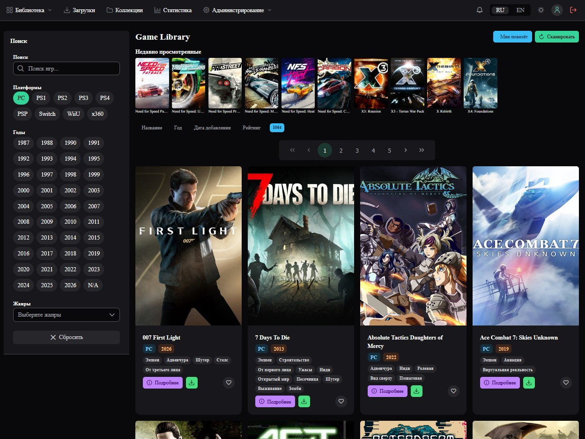
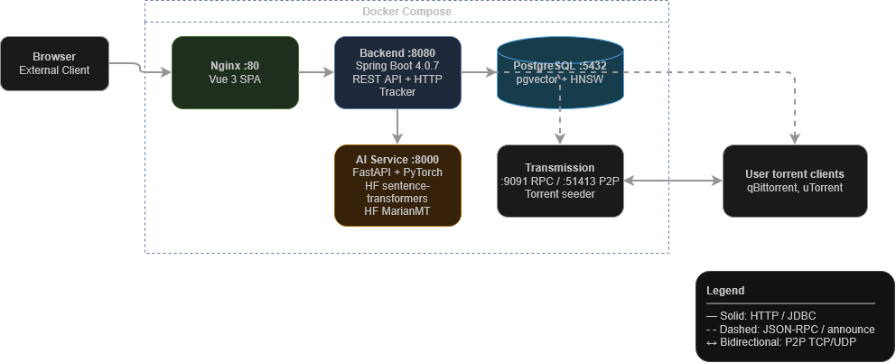
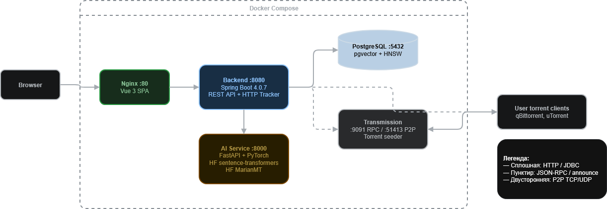

# GameLibrary

<p align="center">
  
  
  
  
  
</p>

<p align="center">
  <b>EN:</b> Game catalog manager for NAS — filesystem scanning, metadata from 9 scrapers, browse & download via P2P torrents.
  <br>
  <b>RU:</b> Каталогизатор компьютерных игр для NAS — сканирование файловой системы, сбор метаданных из 9 скраперов, просмотр и скачивание через P2P-торренты.
</p>

<p align="center">
  
</p>

<p align="center">
  <a href="#en">🇬🇧 English</a> &nbsp;|&nbsp; <a href="#ru">🇷🇺 Русский</a>
</p>

<p align="center">
  <a href="#-features">Features</a> &nbsp;•&nbsp;
  <a href="#-quick-start">Quick Start</a> &nbsp;•&nbsp;
  <a href="docs/INSTRUCTION.md">Instruction</a> &nbsp;•&nbsp;
  <a href="docs/API.md">API</a> &nbsp;•&nbsp;
  <a href="#-tech-stack">Tech Stack</a> &nbsp;•&nbsp;
  <a href="#-architecture">Architecture</a> &nbsp;•&nbsp;
  <a href="#-configuration">Configuration</a> &nbsp;•&nbsp;
  <a href="#-scrapers">Scrapers</a> &nbsp;•&nbsp;
  <a href="#-deployment">Deployment</a>
</p>

---

<a name="en"></a>

# 🇬🇧 English

## ✨ Features

| For users | For admins |
|-----------|-----------|
| Game grid with posters & filters | Filesystem scanning & auto-indexing |
| Search by name, platform, genre, year | Metadata scraping (9 scrapers) |
| Sorting & pagination | Game editor with Quill rich text |
| ZIP download (<5 GB) / .torrent download (≥5 GB) | User management (roles, block, reset password) |
| P2P seeding via Transmission | Scraper config panel (API keys, enable/disable) |
| | 🖥️ Admin dashboard (library state, scan progress, disk usage) |
| Profile, avatar, password change | |
| Russian / English UI | |
| ⭐ Rating 1-10 per game | |
| ❤️ Favorites collection with filter | |
| 🌓 Dark mode (system-preference auto-detect, manual toggle) | |
| 🖥️ 4 visual themes (default light/dark, retro terminal, yellowed CRT) | |
| 💬 Comments on game pages | |
| 🔔 Notifications (torrent ready, scan done, etc.) | |
| 👁 View history (last 20, localStorage) | |
| 🔗 Related games (same genre or similar name) | |
| 📊 Statistics dashboard (charts by platform/genre/year, top lists) | |
| 📂 Game collections (playlists, public/private, reorder) | |
| 📝 Detailed reviews (gameplay/graphics/story/music scores 1-10, pros/cons) | |
| 🏷️ Tags (custom labels, filter in sidebar) | |
| 🧠 Smart collections (server-side rules evaluation, auto-matched games) | |
| 🔍 Semantic search (vector search by description meaning, Python AI + pgvector) | |
| 🌐 Translation ru↔en (game descriptions via Python AI, cached in DB) | |
| 🏷️ Auto-tagging (keyword-based tag & genre suggestions from description) | |
| 🧠 AI recommendations (personalized game suggestions) | |
| 🖼️ Screenshot auto-tagging (AI analysis of game screenshots) | |


## ⚡ Quick Start

```bash
cp .env.example .env          # set secrets first
make all                      # builds backend + frontend, starts docker-compose
```

Open `http://localhost` — login as `admin` / `password`.

> 📖 **Step-by-step guide** — [docs/INSTRUCTION.md](docs/INSTRUCTION.md)
> 📋 **API Reference** — [docs/API.md](docs/API.md)

### AI Features (Optional)

Semantic search & translation are powered by a separate Python AI service (`ai-service`). Auto-tagging works without AI.

**AI models** (auto-downloaded from HuggingFace on first start):
- Embedding: [`intfloat/multilingual-e5-small`](https://huggingface.co/intfloat/multilingual-e5-small) — 384-dim vectors
- Translation: [`facebook/nllb-200-distilled-600M`](https://huggingface.co/facebook/nllb-200-distilled-600M) — single model for both directions

If you don't need AI — comment out the `ai-service:` block in `docker-compose.yml` (saves ~2 GB RAM and ~2 GB disk).

## 📦 Tech Stack

| Component | Technology |
|-----------|-----------|
| Backend | Spring Boot 4.0.7, Java 25, Virtual Threads (Project Loom) |
| Frontend | Vue 3 + Vite 5, PrimeVue 4, Pinia, VueQuill (Quill 2) |
| Database | PostgreSQL 16 (schema `library`) + pgvector |
| ORM / JDBC | Hibernate, Spring Data JPA, HikariCP |
| REST API | Spring MVC, JWT + form login |
| API Docs | Swagger UI at `/game-library/swagger-ui.html` |
| Downloads | ZIP (STORED, no compression) + BitTorrent via Transmission |
| P2P Tracker | Built-in HTTP tracker at `/api/tracker/announce` |
| Scraping | OkHttp 4, Jsoup, Steam Storefront API, LaunchBox API, GOG HTML |
| Rate Limiting | bucket4j 8.7.0 (in-memory per-IP token bucket) |
| Images | DB bytea + FS override, ETag + Cache-Control (24h), lazy loading |
| AI / ML | Python FastAPI, PyTorch, HuggingFace |
| Containerization | Docker, docker-compose (5 services) |

## 🏗 Architecture

<p align="center">
  
</p>

### Frontend Routes

| URL | Access | Description |
|-----|--------|-------------|
| `/login` | all | Login form |
| `/register` | all | Registration |
| `/` | USER, ADMIN | Library grid — filters, sorting, pagination |
| `/game/:id` | USER, ADMIN | Game detail page |
| `/game/:id/edit` | ADMIN | Editor + scraping panel |
| `/profile` | USER | Profile (avatar, password, stats) |
| `/admin/users` | ADMIN | User management |
| `/admin/scrapers` | ADMIN | Scraper config (API keys, on/off) |
| `/downloads` | USER, ADMIN | Transmission seeding status |
| `/statistics` | USER, ADMIN | Statistics dashboard |
| `/collections` | USER, ADMIN | Game collections |
| `/collections/:id` | USER, ADMIN | Collection detail |

## 🔧 Configuration

### Filesystem Layout

```
<games_directory>/games/
└── <platform>/                       (e.g. PC, PlayStation, Xbox)
    └── <game_name>/
        ├── <game files>...
        └── information/              (created during scan)
            ├── logo.jpg              (poster)
            ├── information.json      (name, year, genres, description, trailer)
            └── img/                  (screenshots .jpg)
```

### Environment Variables

#### Required (no defaults — must be set in `.env`)

| Variable | Description |
|----------|-------------|
| `POSTGRES_PASSWORD` | PostgreSQL superuser password |
| `DB_PASSWORD` | PostgreSQL application user (`library-manager-user`) password |
| `JWT_SECRET` | JWT signing secret (`openssl rand -hex 32`) |
| `SCRAPER_ENCRYPTION_KEY` | AES-256 base64 key for scraper API key encryption (`openssl rand -base64 32`) |

#### Optional (with defaults)

| Variable | Default | Description |
|----------|---------|-------------|
| `SERVER_PORT` | `8080` | Backend port |
| `DB_HOST` | `localhost` | PostgreSQL host |
| `DB_PORT` | `5432` | PostgreSQL port |
| `GAMES_DIRECTORY` | `/gameLibrary` | Game files root |
| `IMAGES_DIRECTORY` | `/gameLibrary/images` | Images on filesystem |
| `TRACKER_ANNOUNCE_URL` | `http://localhost:8080/game-library/api/tracker/announce` | Announce URL in .torrent files |
| `TRANSMISSION_RPC_URL` | `http://transmission:9091/transmission/rpc` | Transmission RPC endpoint |
| `TRANSMISSION_DOWNLOAD_DIR` | `/downloads` | Download dir in Transmission container |
| `CORS_ALLOWED_ORIGINS` | *(empty — same-origin only)* | Allowed CORS origins (comma-separated) |
| `AI_SERVICE_URL` | `http://ai-service:8000` | Python AI service endpoint |
| `JWT_EXPIRATION_MS` | `86400000` | Token TTL (24 hours) |
| `SCRAPER_CONFIG_DIR` | `/gameLibrary/gameLibraryConfigs/scrapers` | Directory with `scrapers-config.json` |
| `RESET_PASSWORD_DEFAULT` | *(auto-generated)* | Override default password for admin password-reset |

### Database Schema

Schema `library`:

| Table | Purpose |
|-------|---------|
| `game_data` | Games (name, platform, description, embedding vector(384), size) |
| `game_genre` | Genre dictionary (~70 entries) |
| `game_data_genre` | M:N game ↔ genre |
| `game_screenshot` | Screenshots (bytea) |
| `game_rating` | Ratings 1-10 (unique user+game) |
| `favorite_game` | User favorites |
| `game_comment` | Comments |
| `notification` | Notifications |
| `game_collection` | Collections (regular + smart) |
| `game_collection_entry` | M:N collection ↔ game |
| `game_tag` | Tag dictionary |
| `game_data_tag` | M:N game ↔ tag |
| `game_review` | Reviews (4 category scores 1-10, pros/cons) |
| `library_user` | Users (BCrypt, roles) |

DDL: `postgresdb/ddl/` — execute at first container start in alphabetical order.

## 🔒 Security

All credentials are externalized via `.env` (`.env` is in `.gitignore` — **never commit it**).

| Secret | Path |
|--------|------|
| `POSTGRES_PASSWORD` | `.env` → docker-compose → postgres |
| `DB_PASSWORD` | `.env` → docker-compose → backend → `application.yml` |
| `JWT_SECRET` | `.env` → docker-compose → backend → JWT signing |
| `SCRAPER_ENCRYPTION_KEY` | `.env` → docker-compose → backend → AES-256 scraper key encryption |

- JWT access token (15 min) + refresh token (7 days), refresh handled silently by Axios interceptor
- Rate limiting: login 5 req/min (IP+User-Agent), API 100 req/min (IP) → HTTP 429
- DB password never stored in `application.yml` in plaintext
- Admin password reset: `SecureRandom` generates 8-byte base64 password

## 🕷 Scrapers

Config: `${SCRAPER_CONFIG_DIR}/scrapers-config.json`, managed via `/api/admin/scraper-config`.

| Scraper | Method | Auth | What it scrapes |
|---------|--------|------|----------------|
| **Playground** (playground.ru) | CSS selectors + search API | — | Name, description, genres, screenshots |
| **Igromania** (igromania.ru) | JSON Path | — | Game data via `initialStoreState` |
| **Steam** (store.steampowered.com) | Storefront API | — | Name, description, screenshots, genres |
| **IGDB** (api.igdb.com) | REST API | Twitch OAuth 2.0 | Full metadata |
| **TheGamesDB** (api.thegamesdb.net) | REST API | API key | Full metadata (1000 req/month) |
| **World-Art** (world-art.ru) | CSS selectors | — | Card parsing + search |
| **PsxDataCenter** (psxdatacenter.com) | JSoup (HTML parsing) | — | PS1/PS2: description, genres, screenshots, serial number |
| **LaunchBox** (gamesdb.launchbox-app.com) | REST API | — | Name, description, screenshots (all media), genres, trailer |
| **GOG** (gog.com) | HTML parsing | — | Name, description, screenshots, genres |

### IGDB Setup

1. Create app at https://dev.twitch.tv/console/apps/create
2. Copy **Client-ID**, create **Client Secret**
3. Get access token:
   ```bash
   curl -X POST "https://id.twitch.tv/oauth2/token?client_id=ID&client_secret=SECRET&grant_type=client_credentials"
   ```
4. Admin panel (`/admin/scrapers`) → IGDB → `headers.Client-ID` and `encryptedApiKey`

### TheGamesDB Setup

1. Register at https://thegamesdb.net/register.php
2. Get key at https://api.thegamesdb.net/key.php
3. Admin panel → TheGamesDB → `encryptedApiKey`

## 🚀 Deployment

### System Requirements

#### Minimum (AI features disabled)

| Resource | Minimum |
|----------|---------|
| CPU | 1 core |
| RAM | 2 GB |
| Storage | 100 MB (application) + game library |

#### With AI features (recommended)

| Resource | Minimum |
|----------|---------|
| CPU | 2 cores (Intel N4505 / ARM Cortex-A55 or better) |
| RAM | 4 GB |
| Storage | 2 GB (application + AI models) + game library |
| PostgreSQL | pgvector extension (`pgvector/pgvector:pg16`) |

Embedding inference: ~200-500ms per game. Translation: ~1-5s per description. CPU only — no GPU required.

### Docker (recommended)

```bash
# 1. Prepare secrets
cp .env.example .env
# Edit .env — set all required variables

# 2. Create directory structure
mkdir -p /mnt/nas/gameLibrary/{games,images,gameLibraryConfigs/{db/data,scrapers,models,tracker/{config,watch,complete,incomplete,torrents}}}

# 3. Start
make all
```

Host directory structure:

```
/mnt/nas/gameLibrary/
├── games/                             # Game files
├── images/                            # Screenshots and covers
└── gameLibraryConfigs/
    ├── db/data/                       # PostgreSQL data
    ├── scrapers/                      # scrapers-config.json
    ├── models/                        # HuggingFace models
    └── tracker/
        ├── config/                    # Transmission settings.json
        ├── watch/                     # Auto-add .torrent files
        ├── complete/                  # Completed downloads
        ├── incomplete/                # Incomplete downloads
        └── torrents/                  # .torrent files
```

Ports:

| Port | Service | Purpose |
|------|---------|---------|
| `:80` | Nginx | Vue SPA + API proxy |
| `:8080` | Backend | REST API + HTTP tracker |
| `:8000` | AI service | Translation + embedding inference |
| `:9091` | Transmission | RPC web UI |
| `:51413` | Transmission | P2P traffic (TCP/UDP) |
| `:5432` | PostgreSQL | Database |

### Local Development

```bash
export $(grep -v '^#' .env | xargs)

# Backend (requires local PostgreSQL)
mvn spring-boot:run -Dspring.profiles.active=alone

# Frontend (Vite dev server, proxies /game-library/* to :8080)
cd frontend && npm run dev
```

Makefile helpers:

```bash
make dev-backend    # mvn spring-boot:run
make dev-frontend   # npm run dev
make logs           # docker compose logs -f
make clean          # docker compose down -v + mvn clean + rm -rf frontend/dist
```

## 🔍 Troubleshooting

| Symptom | Likely cause | Fix |
|---------|-------------|-----|
| Blank page | nginx proxy misconf | Check nginx.conf `/game-library` location |
| Backend can't connect to DB | Wrong host/port/password | Check `DB_HOST`, `DB_PORT` |
| Torrent download stuck at 0% | uTP disabled | `"preferred_transports": ["utp", "tcp"]` in `settings.json` |
| `403 Invalid CORS request` | `CORS_ALLOWED_ORIGINS` not set | Add to `.env` and `docker-compose.yml` |
| Containers crash | Empty `.env` | Verify all 4 required variables are set |
| AI not working | Models not downloaded | Wait for first HuggingFace download (~2 GB) |

<a name="ru"></a>

# 🇷🇺 Русский

## ✨ Возможности

| Для пользователей | Для администраторов |
|------------------|-------------------|
| Сетка игр с постерами и фильтрами | Сканирование ФС и авто-индексация |
| Поиск по названию, платформе, жанру, году | Сбор метаданных из 9 скраперов |
| Сортировка и пагинация | Редактор игр с Quill (rich text) |
| Скачивание ZIP (<5 ГБ) / .torrent (≥5 ГБ) | Управление пользователями (роли, блокировка, сброс пароля) |
| P2P-раздача через Transmission | Панель конфигурации скраперов (API-ключи, вкл/выкл) |
| | 🖥️ Панель администратора (состояние библиотеки, прогресс сканирования, занятое место) |
| Профиль, аватар, смена пароля | |
| Русский / английский интерфейс | |
| ⭐ Рейтинг игр 1-10 | |
| ❤️ Избранное с фильтром в боковой панели | |
| 🌓 Тёмная тема (авто-определение по системе, ручное переключение) | |
| 🖥️ 4 визуальные темы (светлая/тёмная, ретро-терминал, жёлтый CRT) | |
| 💬 Комментарии на странице игры | |
| 🔔 Уведомления (торрент готов, сканирование завершено и т.д.) | |
| 👁 История просмотров (последние 20, localStorage) | |
| 🔗 Связанные игры (жанр или похожее название) | |
| 📊 Статистика библиотеки (диаграммы по платформам/жанрам/годам, топы) | |
| 📂 Коллекции игр (плейлисты, публичные/приватные, сортировка) | |
| 📝 Рецензии (оценки геймплея/графики/сюжета/музыки 1-10, плюсы/минусы) | |
| 🏷️ Теги (пользовательские метки, фильтр в боковой панели) | |
| 🧠 Умные коллекции (правила оцениваются на сервере, авто-подбор игр) | |
| 🔍 Семантический поиск (векторный поиск по смыслу, Python AI + pgvector) | |
| 🌐 Перевод ru↔en (описания игр через Python AI, кешируется в БД) | |
| 🏷️ Авто-теги (подбор тегов и жанров по ключевым словам) | |
| 🧠 AI-рекомендации (персональные рекомендации игр) | |
| 🖼️ Авто-теги по скриншотам (AI-анализ скриншотов игры) | |


## ⚡ Быстрый старт

```bash
cp .env.example .env          # сначала указать секреты
make all                      # сборка backend + frontend, запуск docker-compose
```

Открыть `http://localhost` — войти как `admin` / `password`.

> 📖 **Пошаговая инструкция** — [docs/INSTRUCTION.md](docs/INSTRUCTION.md)
> 📋 **Описание API** — [docs/API.md](docs/API.md)

### AI-фичи (опционально)

Семантический поиск и перевод работают через Python AI сервис (`ai-service`). Авто-теги работают без AI.

**AI-модели** (скачиваются автоматически с HuggingFace при первом запуске):
- Embedding: [`intfloat/multilingual-e5-small`](https://huggingface.co/intfloat/multilingual-e5-small) — 384-мерные векторы
- Перевод: [`facebook/nllb-200-distilled-600M`](https://huggingface.co/facebook/nllb-200-distilled-600M) — одна модель для обоих направлений

Если AI не нужен — закомментируйте блок `ai-service` в `docker-compose.yml` (экономия ~2 ГБ RAM и ~2 ГБ диска).

## 📦 Технологический стек

| Компонент | Технология |
|-----------|-----------|
| Backend | Spring Boot 4.0.7, Java 25, Virtual Threads (Project Loom) |
| Frontend | Vue 3 + Vite 5, PrimeVue 4, Pinia, VueQuill (Quill 2) |
| База данных | PostgreSQL 16 (схема `library`) + pgvector |
| ORM / JDBC | Hibernate, Spring Data JPA, HikariCP |
| REST API | Spring MVC, JWT + form login |
| Документация API | Swagger UI — `/game-library/swagger-ui.html` |
| Скачивание | ZIP (STORED, без сжатия) + BitTorrent через Transmission |
| P2P-трекер | Встроенный HTTP-трекер — `/api/tracker/announce` |
| Скрапинг | OkHttp 4, Jsoup, Steam Storefront API, LaunchBox API, GOG HTML |
| Rate Limiting | bucket4j 8.7.0 (in-memory, per-IP) |
| Изображения | DB bytea + FS override, ETag + Cache-Control (24ч), lazy loading |
| AI / ML | Python FastAPI, PyTorch, HuggingFace |
| Контейнеризация | Docker, docker-compose (5 сервисов) |

## 🏗 Архитектура

<p align="center">
  
</p>

### Маршруты

| URL | Доступ | Описание |
|-----|--------|----------|
| `/login` | все | Вход |
| `/register` | все | Регистрация |
| `/` | USER, ADMIN | Библиотека (сетка, фильтры, пагинация) |
| `/game/:id` | USER, ADMIN | Карточка игры |
| `/game/:id/edit` | ADMIN | Редактирование + скрапинг |
| `/profile` | USER | Профиль (аватар, пароль, статистика) |
| `/admin/users` | ADMIN | Управление пользователями |
| `/admin/scrapers` | ADMIN | Настройка скраперов |
| `/downloads` | USER, ADMIN | Статус раздач Transmission |
| `/statistics` | USER, ADMIN | Статистика библиотеки |
| `/collections` | USER, ADMIN | Коллекции игр |
| `/collections/:id` | USER, ADMIN | Детали коллекции |

## 🔧 Конфигурация

### Структура файлов

```
<games_directory>/games/
└── <platform>/                       (PC, PlayStation, Xbox, ...)
    └── <game_name>/
        ├── <файлы игры>...
        └── information/              (создаётся при сканировании)
            ├── logo.jpg
            ├── information.json      (название, год, жанры, описание, трейлер)
            └── img/                  (скриншоты .jpg)
```

### Переменные окружения

#### Обязательные (задаются в `.env`)

| Переменная | Описание |
|-----------|----------|
| `POSTGRES_PASSWORD` | Пароль суперпользователя PostgreSQL |
| `DB_PASSWORD` | Пароль пользователя приложения (`library-manager-user`) |
| `JWT_SECRET` | Секрет подписи JWT (`openssl rand -hex 32`) |
| `SCRAPER_ENCRYPTION_KEY` | AES-256 ключ (base64) для шифрования API-ключей скраперов (`openssl rand -base64 32`) |

#### Опциональные (со значениями по умолчанию)

| Переменная | По умолчанию | Описание |
|-----------|-------------|----------|
| `SERVER_PORT` | `8080` | Порт backend |
| `DB_HOST` | `localhost` | Хост PostgreSQL |
| `DB_PORT` | `5432` | Порт PostgreSQL |
| `GAMES_DIRECTORY` | `/gameLibrary` | Корень с играми |
| `IMAGES_DIRECTORY` | `/gameLibrary/images` | Путь к изображениям на ФС |
| `TRACKER_ANNOUNCE_URL` | `http://localhost:8080/game-library/api/tracker/announce` | Announce URL в .torrent |
| `TRANSMISSION_RPC_URL` | `http://transmission:9091/transmission/rpc` | RPC-эндпоинт Transmission |
| `TRANSMISSION_DOWNLOAD_DIR` | `/downloads` | Папка загрузок Transmission |
| `CORS_ALLOWED_ORIGINS` | *(только same-origin)* | Разрешённые CORS-источники |
| `AI_SERVICE_URL` | `http://ai-service:8000` | Эндпоинт AI сервиса |
| `JWT_EXPIRATION_MS` | `86400000` | Время жизни токена (24ч) |
| `SCRAPER_CONFIG_DIR` | `/gameLibrary/gameLibraryConfigs/scrapers` | Директория с `scrapers-config.json` |
| `RESET_PASSWORD_DEFAULT` | *(авто-генерация)* | Пароль по умолчанию при сбросе админом |

### База данных

Схема `library`:

| Таблица | Назначение |
|---------|-----------|
| `game_data` | Игры (название, платформа, описание, embedding vector(384), размер) |
| `game_genre` | Справочник жанров (~70 записей) |
| `game_data_genre` | M:N игра ↔ жанр |
| `game_screenshot` | Скриншоты (bytea) |
| `game_rating` | Оценки 1-10 (unique user+game) |
| `favorite_game` | Избранное |
| `game_comment` | Комментарии |
| `notification` | Уведомления |
| `game_collection` | Коллекции (обычные + умные) |
| `game_collection_entry` | M:N коллекция ↔ игра |
| `game_tag` | Справочник тегов |
| `game_data_tag` | M:N игра ↔ тег |
| `game_review` | Рецензии (4 категории 1-10, плюсы/минусы) |
| `library_user` | Пользователи (BCrypt, роли) |

DDL: `postgresdb/ddl/` — выполняются при первом запуске контейнера PostgreSQL в алфавитном порядке.

## 🔒 Безопасность

Все учётные данные вынесены в `.env` (`.env` в `.gitignore` — **не коммитить**).

| Секрет | Путь |
|--------|------|
| `POSTGRES_PASSWORD` | `.env` → docker-compose → postgres |
| `DB_PASSWORD` | `.env` → docker-compose → backend → `application.yml` |
| `JWT_SECRET` | `.env` → docker-compose → backend → подпись JWT |
| `SCRAPER_ENCRYPTION_KEY` | `.env` → docker-compose → backend → AES-256 шифрование ключей скраперов |

- JWT access token (15 мин) + refresh token (7 дн), refresh — silently через Axios interceptor
- Rate limiting: login 5 запр/мин (IP+User-Agent), API 100 запр/мин (IP) → HTTP 429
- Пароль БД никогда не хранится в `application.yml` в открытом виде
- Сброс пароля админом: `SecureRandom` генерирует 8-байтовый base64-пароль

## 🕷 Скраперы

Конфиг: `${SCRAPER_CONFIG_DIR}/scrapers-config.json`, управление через `/api/admin/scraper-config`.

| Скрапер | Метод | Ключ | Что собирает |
|---------|-------|------|-------------|
| **Playground** (playground.ru) | CSS + search API | — | Название, описание, жанры, скриншоты |
| **Igromania** (igromania.ru) | JSON Path | — | Данные через `initialStoreState` |
| **Steam** (store.steampowered.com) | Storefront API | — | Название, описание, скриншоты, жанры |
| **IGDB** (api.igdb.com) | REST API | Twitch OAuth 2.0 | Полные метаданные |
| **TheGamesDB** (api.thegamesdb.net) | REST API | API-ключ | Полные метаданные (1000 запр/мес) |
| **World-Art** (world-art.ru) | CSS | — | Карточка + поиск |
| **PsxDataCenter** (psxdatacenter.com) | JSoup | — | PS1/PS2: описание, жанры, скриншоты, серийный номер |
| **LaunchBox** (gamesdb.launchbox-app.com) | REST API | — | Название, описание, скриншоты (все медиа), жанры, трейлер |
| **GOG** (gog.com) | HTML-парсинг | — | Название, описание, скриншоты, жанры |

### Настройка IGDB

1. Создать приложение: https://dev.twitch.tv/console/apps/create
2. Скопировать Client-ID, создать Client Secret
3. Получить токен:
   ```bash
   curl -X POST "https://id.twitch.tv/oauth2/token?client_id=ID&client_secret=SECRET&grant_type=client_credentials"
   ```
4. В админке (`/admin/scrapers`) → IGDB → `headers.Client-ID` и `encryptedApiKey`

### Настройка TheGamesDB

1. Зарегистрироваться: https://thegamesdb.net/register.php
2. Получить ключ: https://api.thegamesdb.net/key.php
3. В админке → TheGamesDB → `encryptedApiKey`

## 🚀 Развёртывание

### Системные требования

#### Минимальные (без AI)

| Ресурс | Минимум |
|--------|---------|
| CPU | 1 ядро |
| RAM | 2 ГБ |
| Диск | 100 МБ (приложение) + игры |

#### С AI (рекомендуется)

| Ресурс | Минимум |
|--------|---------|
| CPU | 2 ядра |
| RAM | 4 ГБ |
| Диск | 2 ГБ (приложение + AI-модели) + игры |
| PostgreSQL | pgvector (`pgvector/pgvector:pg16`) |

Embedding: ~200-500ms/игру. Перевод: ~1-5s/описание. Всё на CPU — GPU не требуется.

### Docker (рекомендуется)

```bash
# 1. Подготовить секреты
cp .env.example .env
# Отредактировать .env

# 2. Создать структуру папок
mkdir -p /mnt/nas/gameLibrary/{games,images,gameLibraryConfigs/{db/data,scrapers,models,tracker/{config,watch,complete,incomplete,torrents}}}

# 3. Запустить
make all
```

Структура на хосте:

```
/mnt/nas/gameLibrary/
├── games/                             # Файлы игр
├── images/                            # Скриншоты и обложки
└── gameLibraryConfigs/
    ├── db/data/                       # Данные PostgreSQL
    ├── scrapers/                      # scrapers-config.json
    ├── models/                        # HuggingFace модели
    └── tracker/
        ├── config/                    # Transmission settings.json
        ├── watch/                     # Авто-добавление .torrent
        ├── complete/                  # Завершённые загрузки
        ├── incomplete/                # Незавершённые загрузки
        └── torrents/                  # .torrent файлы
```

Порты:

| Порт | Сервис | Назначение |
|------|--------|-----------|
| `:80` | Nginx | Vue SPA + прокси на API |
| `:8080` | Backend | REST API + HTTP-трекер |
| `:8000` | AI сервис | Перевод + embedding |
| `:9091` | Transmission | RPC веб-интерфейс |
| `:51413` | Transmission | P2P-трафик |
| `:5432` | PostgreSQL | База данных |

### Локальная разработка

```bash
export $(grep -v '^#' .env | xargs)

# Backend (нужен локальный PostgreSQL)
mvn spring-boot:run -Dspring.profiles.active=alone

# Frontend (Vite dev server, прокси на :8080)
cd frontend && npm run dev
```

Makefile:

```bash
make dev-backend    # mvn spring-boot:run
make dev-frontend   # npm run dev
make logs           # docker compose logs -f
make clean          # docker compose down -v + mvn clean + rm -rf frontend/dist
```

## 🔍 Типовые проблемы

| Симптом | Причина | Решение |
|---------|---------|---------|
| Пустая страница | Неправильный прокси nginx | Проверить location `/game-library` в nginx.conf |
| Backend не видит БД | Неверный хост/порт/пароль | Проверить `DB_HOST`, `DB_PORT` |
| Торрент не скачивается | uTP выключен | `"preferred_transports": ["utp", "tcp"]` в `settings.json` |
| `403 Invalid CORS request` | Не задан `CORS_ALLOWED_ORIGINS` | Добавить в `.env` и `docker-compose.yml` |
| Контейнеры падают | Не заполнен `.env` | Проверить все 4 обязательные переменные |
| AI не работает | Модели не загружены | Дождаться первой загрузки с HuggingFace (~2 ГБ) |

